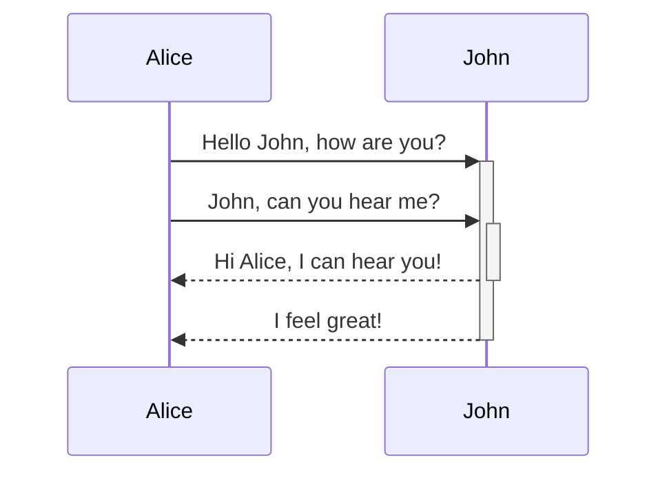
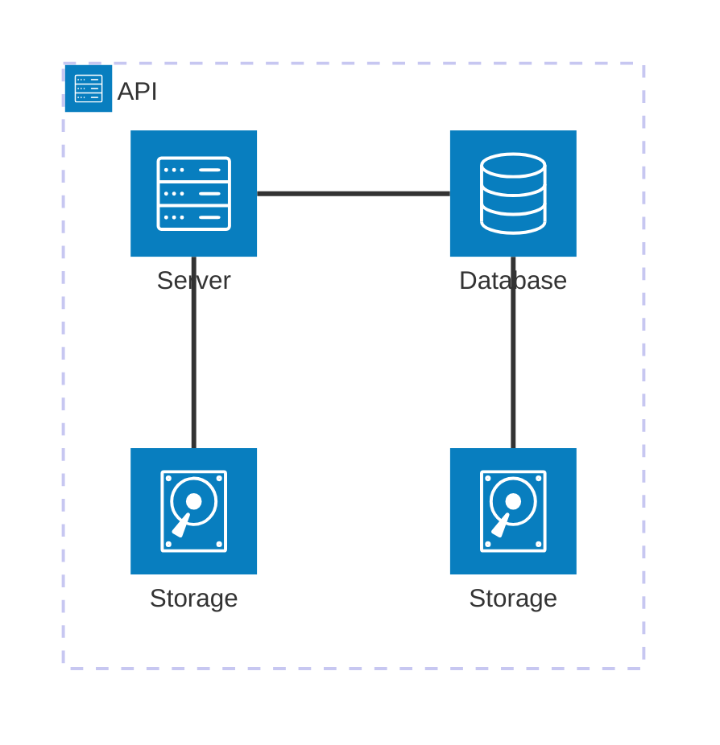

# Обзор архитектуры

Кратко опишите, что представляет собой система, какие задачи она решает, кто/что ее использует, а также основной архитектурный стиль или схему, если это очевидно.

## 1. Структура проекта

- Вся информация в директории Docs
- Весь исходный код в директории src
  - Микросервисы в отдельных поддиректориях (у каждого независимого отдельного функционала приветсвуется файл с описанием README.md и Dockerfile)
- Директория /Volumes (для храниения данных которые подключаюся )

docker-commpose.yaml

## 2. Схема высокоуровневой системы

Представьте общую или текстовую диаграмму, показывающую основных участников, приложения, службы, хранилища данных и внешние системы.

На диаграмме следует выделить:

- Точки входа пользователя или клиента
- Границы приложения/среды выполнения
- Внутренние службы или модули.
- Хранилища данных
- Внешние API или платформы
- Направление обмена данными/потока данных

## 3. основные компоненты

Опишите каждый основной компонент системы.

Для каждого компонента укажите:

- Имя
- Ответственность
- Важные файлы/каталоги
- Ключевые технологии/платформы
- Роль во время выполнения
- Основные входные и выходные данные
- Зависимости от других компонентов
- Примечания о владельце бизнес-логики, состояния или побочных эффектов

Используйте такие подразделы, как:

### 3.1 Внешний интерфейс / User Interface

Если есть, документ:

- Фреймворк и модель визуализации
- Маршрутизация/структура страницы
- Управление состоянием
- API/шаблон доступа к данным
- Организация компонентов
- Стиль/дизайн-системный подход, если это применимо с архитектурной точки зрения
- Создание выходных данных и допущений для развертывания

### 3.2 Серверная часть / API

Если есть, задокументируйте:

- Фреймворк/среда выполнения
- Точки входа
- Структура маршрутизации/контроллера
- Уровень сервиса/бизнес-логики
- Уровень сохраняемости
- Промежуточное программное обеспечение
- Поток аутентификации/авторизации
- Фоновые задания/работники, если они есть

### 3.3 Общие библиотеки / общий код

Если они есть, документируйте:

- Общие типы
- Утилиты
- Модели предметной области
- Схемы проверки
- Сквозные абстракции

### 3.4 CLI / скрипты / автоматизация

Если они есть, документируйте:

- Точки ввода команд
- Автоматизация сборки/тестирования/развертывания
- Генерация кода
- Сценарии ввода/переноса данных

## 4. Поток данных

Объясните, как данные перемещаются по системе.

Включать:

- Жизненный цикл основного запроса
- Важные действия пользователя или системные рабочие процессы
- Пути чтения/записи
- Границы проверки
- Точки сериализации/десериализации
- Пути обработки ошибок
- Асинхронные потоки/потоки, управляемые событиями, если они присутствуют

По возможности добавьте диаграмму последовательности выполнения для наиболее важных потоков во время выполнения.

## 5. Хранилища данных

Перечислите и опишите все механизмы постоянного или полупостоянного хранения, доступные в кодовой базе.

Для каждого хранилища данных укажите:

- Имя
- Тип/технология
- Назначение
- Основные схемы/таблицы/коллекции/объекты, если их можно обнаружить
- Границы владения
- Подход к миграции или управлению схемой
- Сведения о резервном копировании, хранении или жизненном цикле, если они очевидны

Если постоянное хранилище не очевидно, скажите об этом.

## 6. Внешние интеграции / API

Документируйте все внешние системы, с которыми интегрируется кодовая база.

Для каждой интеграции укажите:

- Название службы
- Назначение
- Метод интеграции, такой как REST, GraphQL, SDK, webhook, OAuth, импорт/экспорт файлов, очередь сообщений
- Где он настроен или вызывается
- Метод аутентификации, если он очевиден
- Поведение при сбое/повторной попытке, если это очевидно

## 7. Ключевые технологии

Обобщите технический стек.

Включать:

- Языки
- Фреймворки
- Среда выполнения/платформа
- Менеджеры пакетов
- Инструменты сборки
- Инструменты тестирования
- Средства компоновки/форматирования
- Инфраструктура/инструменты развертывания
- Инструменты обеспечения наблюдаемости
- Важные библиотеки, которые формируют архитектуру

Объясняют, почему каждая технология важна с точки зрения архитектуры, а не только потому, что она существует.

## 8. Развертывание и инфраструктура

Опишите, как выглядит система при сборке, упаковке, настройке и развертывании.

Включать:

- Создавайте артефакты
- Переменные среды/модель конфигурации
- Контейнеризация, если она присутствует
- Цель размещения/развертывания, если она очевидна
- Рабочие процессы CI/CD
- Инфраструктура как код
- Модель процесса выполнения
- Предположения о масштабировании, если они очевидны

Если развертывание не очевидно из хранилища, четко укажите это и кратко опишите, что необходимо знать.

## 9. Архитектура безопасности

Документируйте архитектуру, относящуюся к безопасности.

Включать:

- Аутентификация
- Авторизация
- Обработка сеанса/токена
- Управление секретами
- Проверка введенных данных
- Шифрование данных при передаче/в состоянии покоя, если это очевидно
- Заголовки CORS/CSP/security, если они присутствуют
- Меры безопасности зависимостей или цепочки поставок
- Границы доверия
- Обработка конфиденциальных данных

Не утверждайте, что средства контроля безопасности существуют, если они не указаны в базе кода.

## 10. Мониторинг и наблюдаемость

Задокументируйте, как можно отлаживать систему и наблюдать за ней.

Включать:

- Метод ведения журнала
- Показатели
- Отслеживание
- Отчеты об ошибках
- Проверки работоспособности
- Журналы аудита
- Инструменты отладки
- Операционные панели мониторинга или службы мониторинга, если они доступны

Если наблюдаемость минимальна или отсутствует, скажите об этом и укажите текущие пробелы.

## 11. Производительность и масштабируемость

Документируйте части архитектуры, чувствительные к производительности.

Включать:

- Кэширование
- Разбивка на страницы
- Пакетная обработка
- Фоновая обработка
- Шаблоны запросов к базе данных
- Оптимизация ресурсов
- Модель параллелизма
- Известные узкие места
- Ограничения масштабирования или допущения

Включайте только утверждения, подтверждаемые кодом, конфигурацией или документацией.

## 12. Рабочий процесс разработки

Объясните, как разработчики работают с проектом.

Включать:

- Локальная настройка
- Необходимые инструменты/версии среды выполнения
- Команды установки
- Команды сервера разработки
- Команды тестирования
- Команды сборки
- Команды Lint/format/typecheck для проверки текста
- Настройка/миграция базы данных, если есть
- Общие циклы разработки

В этом разделе основное внимание уделяется архитектуре; не дублируйте README, если только рабочий процесс не влияет на структуру системы.

## 13. Стратегия тестирования

Опишите архитектуру тестирования.

Включать:

- Тестовые фреймворки
- Места проведения тестирования Unit/integration/e2e
- Настройки/макеты
- Стратегия использования тестовых данных
- Выполнение тестов CI
- Контроль покрытия или качества, если это очевидно
- Пробелы в тестовом покрытии, если это можно сделать из хранилища

## 14. Архитектурные решения и обоснование

Фиксируйте важные архитектурные решения, видимые в кодовой базе.

Для каждого решения укажите:

- Решение
- Доказательства в кодовой базе
- Обоснование, если оно поддается логическому выводу
- Последствия/компромиссы
- Альтернативы, если они упоминаются в документах/комментариях

Не придумывайте историческое обоснование. Если обоснование неясно, укажите “Обоснование не задокументировано”.

## 15. Ограничения, риски и техническая задолженность

Документ:

- Архитектурные ограничения
- Известные ограничения
- Тесная взаимосвязь
- Дублированные абстракции
- Отсутствующие границы
- Незавершенные миграции
- Элементы TODO/FIXME, влияющие на архитектуру
- Операционные риски
- Проблемы безопасности или масштабируемости

В каждом пункте должно быть указано, почему это важно и где в кодовой базе содержатся доказательства.

## 16. Соображения на будущее / Дорожная карта

Обобщите будущие архитектурные изменения, которые очевидны из комментариев к коду, документов, задач, файлов дорожной карты или неполных абстракций.

Разделять:

- Четко задокументированная будущая работа
- Обоснованные архитектурные рекомендации, основанные на существующей структуре

Четко обозначайте рекомендации как рекомендации.

## 17. Идентификация проекта

Включать:

- Название проекта
- Назначение репозитория
- Основной язык (-ы)
- Тип приложения
- Основная среда выполнения (-ы)
- Дата последнего архитектурного обзора
- Сопровождающий/команда, если это очевидно

Используйте сегодняшнюю дату для обозначения “Даты последнего архитектурного обзора”.

## 18. Глоссарий / сокращения

Определите термины, сокращения, концепции предметной области и внутренние имена, которые необходимо знать новому разработчику или агенту искусственного интеллекта.

Пройдите проверку:

- Проверьте соответствие каждого именованного компонента, службы, хранилища данных, интеграции и технологии с репозиторием.
- Удалите заполнители.
- Удалите общий текст шаблона.
- Замените расплывчатые утверждения конкретными фактами, относящимися к кодовой базе.
- Убедитесь, что в документе представлены все основные исходные каталоги.
- Убедитесь, что диаграмма высокого уровня соответствует описаниям компонентов.
- Убедитесь, что документ полезен для тех, кто пытается ответить на вопрос: “Где мне внести изменения и на что это повлияет?”
- Если доступен доступ к работающему локальному серверу, тестам, результатам сборки, сгенерированным документам, схеме API, схеме базы данных, среде Docker или скриншотам, используйте их для проверки и пересмотра описания архитектуры.
